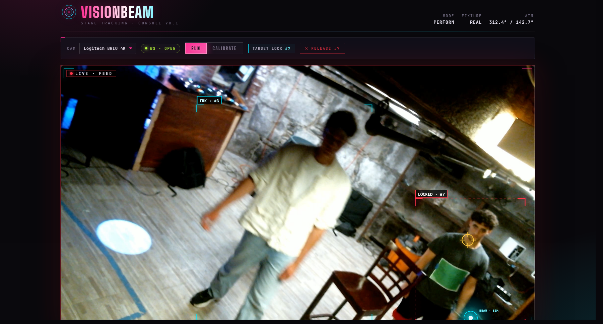

# VisionBeam



## Introduction

VisionBeam is a vision-driven autonomous light fixture that finds the most active person in a room and follows them in real time. There are no body-worn beacons, no pre-programmed cues, and no specialized cameras. A webcam in the browser sends frames to a Python server, the server runs a hybrid YOLOv8 + ByteTrack + masked motion-heatmap tracker, and the resulting target pixel is mapped to fixture pan/tilt and pushed out over USB-to-DMX512.

The project was constructed MIT 6.S058 - Introduction to Computer Vision. The core question is whether combining a deep-learning person detector with classical motion analysis is genuinely more robust than either technique on its own when stage lighting is hostile. An evaluation harness records clips under four controlled lighting conditions, extracts ground truth from a colored marker, runs four target-selection methods on every clip, and writes accuracy / jitter / throughput metrics and figures.

## Project Structure

```
backend/                            # Python: tracker, calibration, DMX, FastAPI server, eval
├── server.py                       # FastAPI + WebSocket: browser frames in, detections + DMX out
├── requirements.txt
├── visionbeam/
│   ├── base.py                     # TargetMethod ABC shared by the production tracker and baselines
│   ├── tracker.py                  # HybridMethod: YOLOv8 + ByteTrack + person-masked motion heatmap
│   ├── aim.py                      # PixelAimCalibration: quadratic pixel -> pan/tilt fit (live system)
│   └── dmx.py                      # USB-to-DMX512 serial driver, fixture profile, MockDMX fallback
├── evaluation/
│   ├── methods.py                  # Baseline targets: frame diff, Farneback flow, detection-only
│   ├── record.py                   # Records 4-condition lighting dataset from a webcam
│   ├── ground_truth.py             # HSV / brightness marker extraction -> per-frame CSV
│   ├── evaluate.py                 # Runs every method on every clip, writes per-clip + summary CSVs
│   └── visualize.py                # Matplotlib figures (accuracy, jitter, FPS, trajectory)
├── calibration/
│   └── aim.json                    # Pixel->pan/tilt calibration (gitignored, written by UI)
├── config/
│   └── fixture_zq02360_15ch.json   # 15-channel ZQ02360 / UKing 120W ring spot used in development
├── data/                           # Recorded clips, ground truth, figures (gitignored, regenerable)
└── results/                        # Per-clip and summary CSVs from evaluate.py (gitignored)

frontend/                           # Vite + React + TypeScript browser client
├── index.html                      # Loads Google Fonts, grain SVG filter, scanlines overlay
├── package.json
├── vite.config.ts
├── public/
│   └── favicon.svg                 # Magenta/cyan ring mark (matches in-app brand glyph)
└── src/
    ├── main.tsx
    ├── App.tsx                     # WebSocket lifecycle, mode (run / calibrate), GSAP intro, control messages
    ├── Viewport.tsx                # Live video + overlay (tracks, target, simulated beam, HUD frame)
    ├── CalibrationPanel.tsx        # Pan/tilt sliders, sample/fit/clear controls, RMS readout
    ├── camera.ts                   # getUserMedia + JPEG capture helpers
    ├── types.ts                    # Shared WebSocket message contracts
    ├── styles.css                  # Stage-console theme: magenta/cyan duotone, grain, scanlines
    └── vite-env.d.ts

```

The CVPR-style writeup of this project lives on Overleaf.

## How the live system fits together

The deployment loop is a thin client / fat server split:

1. The browser captures webcam frames via `getUserMedia`, draws each frame into an offscreen canvas, JPEG-encodes it, and streams it over a single WebSocket (`ws://127.0.0.1:8000/ws/detect`). One frame is in flight at a time — the next is captured only when the server replies, so the system self-throttles to whatever rate the tracker can sustain.
2. The server (`backend/server.py`) decodes the JPEG, runs `HybridMethod.process_frame` (YOLOv8n detection every Nth frame + ByteTrack + person-masked frame differencing + Gaussian-blurred peak), and returns a JSON payload: tracked bounding boxes with persistent IDs, the chosen target pixel, the locked-on ID if any, and the current calibration / DMX state.
3. If the operator has fitted a pixel-to-aim calibration and `auto_aim` is on, the server feeds the target pixel through `PixelAimCalibration.predict` to get fixture pan and tilt, then writes them to DMX via `DMXConnection.aim`. With no DMX adapter attached, the server falls back to `MockDMX` and the UI shows a synthetic beam dot using the same pan/tilt that would have been sent to the real fixture.
4. The React app draws the live video, overlays the bounding boxes, target crosshair, and simulated beam, and exposes two interaction modes:
   - **Run.** Click a person to lock the tracker to that ID; click again (or click the background) to unlock. The light follows the locked track's bounding box centroid, ignoring the motion heatmap.
   - **Calibrate.** Drive the fixture to a sequence of pan/tilt setpoints with sliders, click where the beam dot actually lands in the camera image, fit a quadratic least-squares pixel-to-pan/tilt model, and persist it to `backend/calibration/aim.json`.

The control channel is the same WebSocket, used for plain-text JSON messages: `lock`, `unlock`, `auto_aim`, `aim`, `calibrate_sample`, `calibration_fit`, `calibration_clear`, `set_lamp`. See `Connection`-level handling in [`backend/server.py`](backend/server.py) and the typed shapes in [`frontend/src/types.ts`](frontend/src/types.ts).

## Getting Started

### 1. Backend

From the repository root:

```bash
python3 -m venv .venv
source .venv/bin/activate     # Windows: .venv\Scripts\activate
pip install -r backend/requirements.txt
```

The first run that loads YOLO will download `yolov8n.pt` automatically.

Run the server (development mode, with reload):

```bash
cd backend
VISIONBEAM_NO_DMX=1 uvicorn server:app --reload
```

Environment variables:

| Variable | Purpose |
|----------|---------|
| `VISIONBEAM_NO_DMX=1` | Force `MockDMX`. No hardware required; the UI shows a synthetic beam dot. |
| `VISIONBEAM_DMX_PORT=/dev/tty.usbserial-XXXX` | Override DMX serial port. Otherwise the server scans `/dev/tty.usbserial-*`, `/dev/tty.usbmodem*`, `/dev/ttyUSB*`, `/dev/ttyACM*` and uses the first match, falling back to `MockDMX`. |
| `VISIONBEAM_FIXTURE=path/to/profile.json` | Override fixture profile. Default: `backend/config/fixture_zq02360_15ch.json`. |

A quick health probe is exposed at `GET http://127.0.0.1:8000/health` and reports calibration status.

### 2. Frontend

```bash
cd frontend
npm install
npm run dev
```

By default the client connects to `ws://127.0.0.1:8000/ws/detect`. Override with `VITE_WS_URL` if you run the server on a different host or port:

```bash
VITE_WS_URL=ws://192.168.1.50:8000/ws/detect npm run dev
```

Open the printed Vite URL in a browser, grant camera access, pick a camera from the dropdown, and the live tracking overlay should appear within a second of the WebSocket reaching `open`.

### 3. Pixel-to-aim calibration (live system)

The live tracking-to-DMX path uses a quadratic pixel-to-pan/tilt mapping fit from operator clicks; see `PixelAimCalibration` in [`backend/visionbeam/aim.py`](backend/visionbeam/aim.py). To set it up:

1. With the camera and fixture both visible, switch the UI to **Calibrate**. Auto-aim is automatically disabled while calibrating so the live aim doesn't fight the manual sliders.
2. Move the **Pan** and **Tilt** sliders. The fixture follows in real time (white light at full dimmer for visibility).
3. Click in the camera image where the beam dot is actually landing. The server records `(pan, tilt, px, py)` as a sample.
4. If the dot is off-screen at the current pan/tilt, click **Off-screen** to record an off-screen sample (kept for completeness, excluded from the fit).
5. Repeat for ≥6 in-frame samples spread across the camera view, then click **Fit**. The server solves the quadratic least-squares system separately for pan and for tilt and reports per-axis RMS error in degrees. The fitted coefficients are persisted to `backend/calibration/aim.json` (gitignored — venue-specific).
6. Switch back to **Run**. The live tracker now drives the real fixture (or `MockDMX` if no adapter is present).

`Clear` discards both samples and fitted coefficients and removes `aim.json`.

### 4. Calibration files

The deployed pipeline uses exactly one calibration file. It is venue-specific, written by the in-browser calibration UI, and gitignored so each install keeps its own measured values:

| Path | Used by | Role |
|------|---------|------|
| `backend/calibration/aim.json` | **live system** (`server.py`) | **Gitignored.** Quadratic pixel-to-pan/tilt fit produced by the calibration UI. This is the only spatial transform on the live path: target pixel → quadratic → DMX pan/tilt. |

The offline evaluation harness does not require any calibration file. It compares each method's predicted pixel coordinate to the ground-truth marker pixel directly, in image space.

## Research Evaluation

The evaluation pipeline lives entirely in `backend/evaluation/` and runs offline against pre-recorded clips. All four target-selection methods (the three baselines plus the hybrid) implement the same `TargetMethod` interface — given a frame, return a target pixel — so they can be compared apples-to-apples on the same recordings.

### Methods compared

| Method | Detection | Motion signal | Implementation |
|--------|-----------|---------------|----------------|
| Frame Differencing | None | Classical (full-frame `cv2.absdiff`) | `evaluation/methods.py` |
| Farneback Dense Flow | None | Classical (`cv2.calcOpticalFlowFarneback` magnitude) | `evaluation/methods.py` |
| Detection Only | YOLOv8n + ByteTrack | None | `evaluation/methods.py` |
| **Hybrid (VisionBeam)** | YOLOv8n + ByteTrack | Classical, masked to person bounding boxes | `visionbeam/tracker.py` |

The hybrid is evaluated with `snap_to_feet=False` so the harness measures the raw heatmap peak directly; deployment uses `snap_to_feet=True` to project the peak to the dancer's feet.

### Workflow

```bash
cd backend
mkdir -p data/clips data/gt data/figures results

# 1. Record clips. Interactive prompts pause between conditions so you can change the lights.
python -m evaluation.record --camera 0 --output data/clips --duration 30

# 2. Extract per-frame ground truth from a tracking marker (e.g. bright green plate).
python -m evaluation.ground_truth \
    --video data/clips/<your_clip>.mp4 \
    --mode color \
    --output data/gt \
    --preview

# Tune --hsv-low and --hsv-high until the marker tracks reliably under preview, then
# re-run without --preview to write the final CSV. For each data/clips/foo.mp4,
# ground_truth.py writes data/gt/foo_gt.csv. The evaluation will skip clips with no
# matching GT file.

# 3. Run all methods on all clips and write per-frame + summary CSVs.
python -m evaluation.evaluate \
    --clips data/clips \
    --gt data/gt \
    --output results

# 4. Render figures.
python -m evaluation.visualize --results results --output data/figures
```

Pass `--trajectory-clip <stem>` (filename minus `.mp4`) to `visualize` to plot a specific clip's trajectory; otherwise the first clip in the summary is used.

### Lighting conditions

| Condition | Description |
|-----------|-------------|
| `ambient` | Overhead room lights only. No fixture, no accent. |
| `external_static` | A wall-washer at fixed color/intensity in addition to ambient. |
| `external_dynamic` | Wall-washer animated through color and intensity changes during the clip. |
| `fixture_external_dynamic` | The VisionBeam fixture itself active and aiming at the dancer, plus the dynamic accent light. |

### Metrics

Computed per clip and aggregated over the dataset by `evaluate.py`:

* **Targeting accuracy** — mean Euclidean distance, in pixels, between the predicted target and the ground-truth marker.
* **Target stability (jitter)** — total path length of the predicted aim in pixels, normalized by clip duration.
* **Robustness** — degradation slope from `ambient` to `fixture_external_dynamic`.
* **Processing speed** — wall-clock FPS of `process_frame` on the evaluation hardware.

### Findings (summary)

Across 20 clips (4 conditions × 5 reps), the dataset shows:

* **Detection-only** has the lowest absolute targeting error in every condition, but its apparent stability is partially a failure-mode artifact: under fixture lighting its jitter drops because YOLO confidence sags and frames return `None` rather than because predictions are genuinely steadier.
* **Hybrid** is consistently ~100 px behind detection in absolute pixel error — a geometric offset, not a lighting artifact. The dancer wears a bright green plate marker on their chest, which sits close to the geometric center of a vertical full-body bounding box, so detection's centroid lands near the marker by construction; hybrid's heatmap peak instead lands on whichever body part is moving fastest (often a swinging limb), pulling its prediction off the chest by a body-width-scale offset. Critically, this gap is roughly *constant* across conditions.
* **Hybrid degrades the least under adversity.** From ambient to fixture-active lighting, hybrid's accuracy worsens by 48% and its jitter by 14% — the smallest relative degradation of any method. Frame differencing and Farneback flow more than double in jitter. Detection's accuracy slope is +55%.
* **Hybrid sustains real-time processing speed** (~67 FPS, ~1.8× detection-only) thanks to running YOLO every other frame and reusing ByteTrack predictions in between.

Full numbers, caveats, and discussion are in the writeup on Overleaf.

## Hardware Requirements

1. **DMX moving head** with 16-bit pan/tilt control. Development used a 15-channel ZQ02360 / UKing 120W ring spot (`backend/config/fixture_zq02360_15ch.json`).
2. **USB-to-DMX512 adapter** (Enttec Open DMX or compatible). Optional — the server runs without one and shows a synthetic beam in the UI.
3. **Webcam** running at the browser. 720p is sufficient; the tracker downscales internally to 320 px wide for the motion stage.
4. **Computer** with Python 3.10+ and Node.js 18+. CPU-only YOLOv8n inference clears 30 FPS comfortably on a modern laptop.

## Software Dependencies

**Backend (Python 3.10+):**

* `fastapi` + `uvicorn[standard]` — WebSocket server.
* `opencv-python` — camera capture, frame differencing, Farneback dense flow.
* `ultralytics` — YOLOv8-nano detection and ByteTrack multi-object tracking.
* `torch` — runtime for `ultralytics` (CPU or CUDA).
* `numpy` — math and the pixel-to-pan/tilt least-squares fit.
* `pyserial` — USB-to-DMX512 serial.
* `matplotlib` — evaluation figures.

**Frontend (Node 18+):**

* `react`, `react-dom` (React 19).
* `gsap` — entrance choreography and the lock-on brightness pulse.
* `vite`, `@vitejs/plugin-react`, `typescript`.
